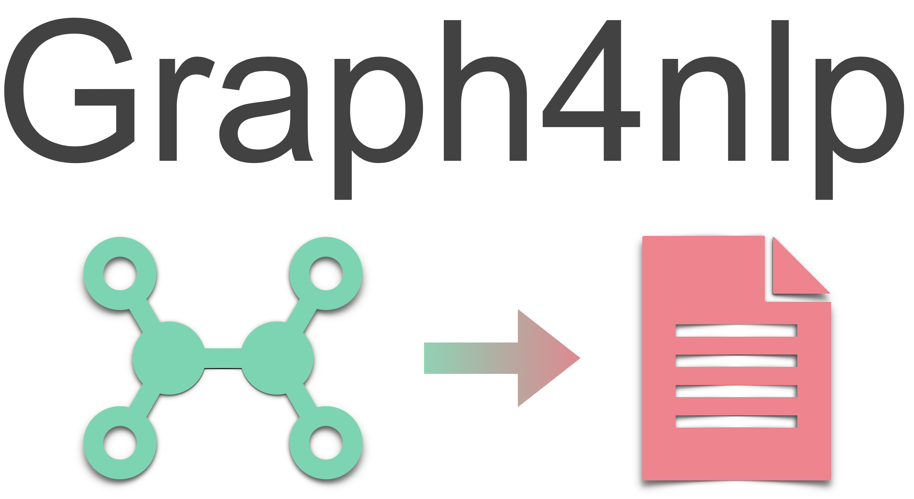
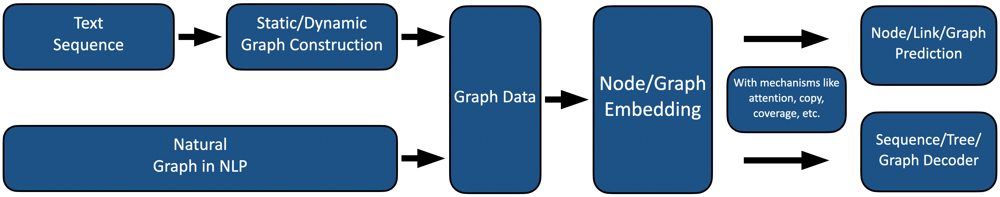

<p align="center">

    <br/>
</p>

[pypi-image]: https://badge.fury.io/py/graph4nlp.svg

[pypi-url]: https://pypi.org/project/graph4nlp

[license-image]:https://img.shields.io/badge/License-Apache%202.0-blue.svg

[license-url]:https://github.com/hugochan/IDGL/blob/master/LICENSE

[contributor-image]:https://img.shields.io/github/contributors/hugochan/IDGL

[contributor-url]:https://github.com/hugochan/IDGL/contributors

[contributing-image]:https://img.shields.io/badge/contributions-welcome-brightgreen.svg?style=flat

[contributing-url]:to_be_add

[issues-image]:https://img.shields.io/github/issues/hugochan/IDGL

[issues-url]:https://github.com/hugochan/IDGL/issues

[forks-image]:https://img.shields.io/github/forks/hugochan/IDGL?style=social

[forks-url]:https://github.com/hugochan/IDGL/fork

[stars-image]:https://img.shields.io/github/stars/hugochan/IDGL?style=social

[stars-url]:https://github.com/hugochan/IDGL/star

### for repo


[![pypi][pypi-image]][pypi-url]
[![Contributors][contributor-image]][contributor-url]
[![Contributing][contributing-image]][contributing-url]
[![License][license-image]][license-url]
[![Issues][issues-image]][issues-url]

### for docs

[![Fork][forks-image]][forks-url]
[![Star][stars-image]][stars-url]

# Graph4NLP

***Graph4NLP*** is an easy-to-use library for R&D at the intersection of **Graph Deep Learning** and
**Natural Language Processing**. It provides both **full implementations** of state-of-the-art models for data scientists and also **flexible interfaces** to build custom models for researchers and developers with whole-pipeline support. Built upon highly-optimized runtime libraries including [DGL](https://github.com/dmlc/dgl) , ***Graph4NLP*** is both high running effieciency and great extensibility. The architecture of ***Graph4NLP*** is shown in the following figure, where boxes with dashed lines represents the features under development.


## Graph4NLP News

**20/05/2021:** The **v1.0.0 release**. Try it out!

## Quick tour

***Graph4nlp*** aims to make it incredibly easy to use GNNs in NLP tasks (
see [here](http://saizhuo.wang/g4nlp/index.html) for tutorial). Here is a example of how to use the [*
Graph2seq*](http://saizhuo.wang/g4nlp/index.html) model (widely used in machine translation, question answering,
semantic parsing, and various other nlp tasks that can be abstracted as graph to sequence problem and show superior
performance).

If you want to further improve model performance, we also provide interfaces of pre-trained models,
including [GloVe](https://nlp.stanford.edu/pubs/glove.pdf), [BERT](https://arxiv.org/abs/1810.04805), etc.

We also offer many other effective models such as graph classification models, graph to tree models, etc. If you are
interested in related research problems, welcome to use our library and refer to our [graph4nlp survey](to_be_add).

```python
from graph4nlp.pytorch.datasets.jobs import JobsDataset
from graph4nlp.pytorch.modules.graph_construction.dependency_graph_construction import DependencyBasedGraphConstruction
from graph4nlp.pytorch.modules.config import get_basic_args
from graph4nlp.pytorch.models.graph2seq import Graph2Seq
from graph4nlp.pytorch.modules.utils.config_utils import update_values, get_yaml_config

# build dataset
jobs_dataset = JobsDataset(root_dir='graph4nlp/pytorch/test/dataset/jobs',
                           topology_builder=DependencyBasedGraphConstruction,
                           topology_subdir='DependencyGraph')  # You should run stanfordcorenlp at background
vocab_model = jobs_dataset.vocab_model

# build model
user_args = get_yaml_config("examples/pytorch/semantic_parsing/graph2seq/config/dependency_gcn_bi_sep_demo.yaml")
args = get_basic_args(graph_construction_name="node_emb", graph_embedding_name="gat", decoder_name="stdrnn")
update_values(to_args=args, from_args_list=[user_args])
graph2seq = Graph2Seq.from_args(args, vocab_model)

# calculation
batch_data = JobsDataset.collate_fn(jobs_dataset.train[0:12])

scores = graph2seq(batch_data["graph_data"], batch_data["tgt_seq"])  # [Batch_size, seq_len, Vocab_size]
```

## Overview

<p align="center">

    <br/>
</p>

## Installation

Currently, users can install Graph4NLP via **pip** or **source code**.

### Installation via pip

| Platform  | Command                       |
| --------- | ----------------------------- |
| CPU       | `pip install graph4nlp`       |
| CUDA 9.2  | `pip install graph4nlp-cu92`  |
| CUDA 10.1 | `pip install graph4nlp-cu101` |
| CUDA 10.2 | `pip install graph4nlp-cu102` |
| CUDA 11.0 | `pip install graph4nlp-cu110` |

### Installation via source code


## Distributing this package
Currently releasing via PyPI is supported. An automated build and distributing shell script is `./build_and_upload_to_pypi.sh`.
You can directly run this script after proper configuration, which will be elaborated below.

### Build the package
To build the package, run `setup.py`. You need to specify whether the binary distribution file(wheel) or source code distribution(tgz)
is wanted. If you want to build the binary version, run
```shell
python setup.py bdist_wheel --universal
```
The `bdist_wheel` option is to say that the binary distribution of wheel file will be built. And the `--universal` option
means the wheel file will fit all platforms.

If you also want to package the source code for distribution, run
```shell
python setup.py sdist
```
Here `sdist` means source distribution. In `build_and_upload_to_pypi.sh` both options will be built. 

### Inside `setup.py`
#### Version 
Everytime the package is updated, a newer version number needs to be specified, otherwise the updated package
cannot be uploaded to PyPI. To update the version number, you need to change the `version` parameter in the `setup()`
  function call in `setup.py`

#### CUDA Compatibility
The only reason why we keep different packages for different CUDA versions is that DGL does so.
In fact our current implementation has nothing to do with CUDA since it is basically a Python frontend of DGL. 
However, CUDA version still needs to be specified in order to make the DGL dependency explicit. 

When running `setup.py`, you will be prompted to input the CUDA version. 
You may just input 'none' for a CPU distribution, otherwise you need to specify the version number explicitly, e.g. `10.2`. 
Then a prefix will be generated and appended to the package name, distinguishing among versions with different CUDA dependency.
For example `graph4nlp-cu101`.

Note that this is just a temporal solution for the distribution of the library.
This part needs to be optimized in the following releases.

### Uploading to PyPI
The `twine` python package is used for uploading the package to PyPI. To use it, first install it using pip:
```shell
pip install twine
```

Then you need to specify your credential, namely to authenticate your account that hosts Graph4NLP on PyPI.

Currently I am using my personal account (swangeh) to host this package and a dedicated account should be used in the future.
You can manually input your username and password everytime you upload the package to PyPI by running
```shell
twine upload dist/*
```
In this way there will be prompts to guide you. 
To save your time you can also generate a credential on PyPI and save it locally in `~/.pypirc`. 
For example inside your `~/.pypirc` it will be
```text
[pypi]
username = <your username>
password = <your password>
```
For details please refer to PyPI. -->

<!-- ### Putting them all together
Above is the decomposition of what's inside `build_and_upload_to_pypi.sh`.
You can just run this script to save your time for building and releasing the package. -->

## More resources

[Docs]() | [Graph4nlp survey]() | [Related paper list]() | [Workshops]()

## Citation

If you found this code useful, please consider citing the following paper:

Yu Chen, Lingfei Wu and Mohammed J. Zaki. **"Iterative Deep Graph Learning for Graph Neural Networks: Better and Robust
Node Embeddings."** In *Proceedings of the 34th Conference on Neural Information Processing Systems (NeurIPS 2020), Dec
6-12, 2020.*

    @article{chen2020iterative,
      title={Iterative Deep Graph Learning for Graph Neural Networks: Better and Robust Node Embeddings},
      author={Chen, Yu and Wu, Lingfei and Zaki, Mohammed},
      journal={Advances in Neural Information Processing Systems},
      volume={33},
      year={2020}
    }