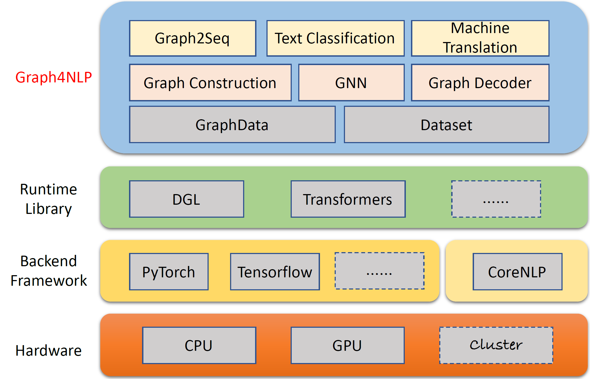
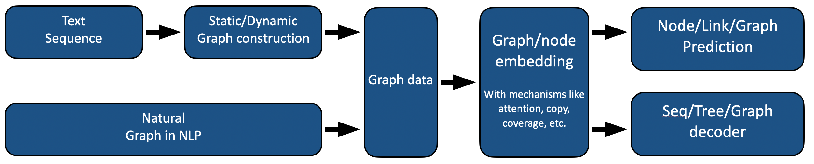

<p align="center"><a href="https://dlg4nlp.github.io/index.html">

    <br/>
    <a/>
</p>
   
[pypi-image]: https://badge.fury.io/py/graph4nlp.svg

[pypi-url]: https://pypi.org/project/graph4nlp

[license-image]:https://img.shields.io/badge/License-Apache%202.0-blue.svg

[license-url]:https://github.com/graph4ai/graph4nlp/blob/master/LICENSE

[contributor-image]:https://img.shields.io/github/contributors/graph4ai/graph4nlp

[contributor-url]:https://github.com/graph4ai/graph4nlp/contributors

[contributing-image]:https://img.shields.io/badge/contributions-welcome-brightgreen.svg?style=flat

[contributing-url]:to_be_add

[issues-image]:https://img.shields.io/github/issues/graph4ai/graph4nlp

[issues-url]:https://github.com/graph4ai/graph4nlp/issues

[forks-image]:https://img.shields.io/github/forks/graph4ai/graph4nlp

[forks-url]:https://github.com/graph4ai/graph4nlp/fork

[stars-image]:https://img.shields.io/github/stars/graph4ai/graph4nlp

[stars-url]:https://github.com/graph4ai/graph4nlp/stars


[![pypi][pypi-image]][pypi-url]
[![Contributors][contributor-image]][contributor-url]
[![Contributing][contributing-image]][contributing-url]
[![License][license-image]][license-url]
[![Issues][issues-image]][issues-url]
[![Fork][forks-image]][forks-url]
[![Star][stars-image]][stars-url]

# Graph4NLP

***Graph4NLP*** is an easy-to-use library for R&D at the intersection of **Deep Learning on Graphs** and
**Natural Language Processing** (i.e., DLG4NLP). It provides both **full implementations** of state-of-the-art models for data scientists and also **flexible interfaces** to build customized models for researchers and developers with whole-pipeline support. Built upon highly-optimized runtime libraries including [DGL](https://github.com/dmlc/dgl) , ***Graph4NLP*** has both high running efficiency and great extensibility. The architecture of ***Graph4NLP*** is shown in the following figure, where boxes with dashed lines represents the features under development. Graph4NLP consists of four different layers: 1) Data Layer, 2) Module Layer, 3) Model Layer, and 4) Application Layer.

<p align="center">
    
    <br>
    <b>Figure</b>: Graph4NLP Overall Architecture
</p>

##  Graph4NLP news
**01/20/2022:** The **v0.5.5 release**. Try it out! <br>
**09/26/2021:** The **v0.5.1 release**. Try it out! <br>
**09/01/2021:** Welcome to visit our **DLG4NLP website (https://dlg4nlp.github.io/index.html)** for various learning resources! <br>
**06/05/2021:** The **v0.4.1 release**. 

## Major Releases

| Releases | Date       | Features                                                     |
| -------- | ---------- | ------------------------------------------------------------ |
| v0.5.5   | 2022-01-20 | - Support model.predict API by introducing wrapper functions. <br /> - Introduce Three new inference_wrapper functions: classifier_inference_wrapper, generator_inference_wrapper, generator_inference_wrapper_for_tree. <br /> - Add the inference and inference_advance examples in each application. <br /> - Separate the graph topology and graph embedding process. <br /> - Renew all the graph construction functions. <br /> - Module graph_embedding is divided into graph_embedding_initialization and graph_embedding_learning. <br /> - Unify the parameters in Dataset. We remove the ambiguous parameter ``graph_type`` and introduce ``graph_name`` to indicate the graph construction method and ``static_or_dynamic`` to indicate the static or dynamic graph  construction type.  <br /> - New: The dataset now can automatically choose the default methods (e.g., ``topology_builder``) by only one parameter `` graph_name ``. |
| v0.5.1   | 2021-09-26 | - Lint the codes <br /> - Support testing with users' own data <br /> - Fix the bug: The word embedding size was hard-coded in the 0.4.1 version. Now it is equal to "word_emb_size" parameter. <br /> - Fix the bug: The build_vocab() is called twice in the 0.4.1 version. <br /> - Fix the bug: The two main files of knowledge graph completion example missed the optional parameter "kg_graph" in ranking_and_hits() when resuming training the model. <br /> - Fix the bug: We have fixed the preprocessing path error in KGC readme. <br /> - Fix the bug: We have fixed embedding construction bug when setting emb_strategy to 'w2v'. |
| v0.4.1   | 2021-06-05 | - Support the whole pipeline of Graph4NLP <br /> - GraphData and Dataset support |

## Quick tour

***Graph4nlp*** aims to make it incredibly easy to use GNNs in NLP tasks (check out [Graph4NLP Documentation](https://graph4ai.github.io/graph4nlp/)). Here is an example of how to use the [*Graph2seq*](https://graph4ai.github.io/graph4nlp/) model (widely used in machine translation, question answering,
semantic parsing, and various other NLP tasks that can be abstracted as graph-to-sequence problem and has shown superior
performance).

<!-- If you want to further improve model performance, we also support pre-trained models including [BERT](https://arxiv.org/abs/1810.04805), etc.
 -->
We also offer other high-level model APIs such as graph-to-tree models. If you are interested in DLG4NLP related research problems, you are very welcome to use our library and refer to our [graph4nlp survey](http://arxiv.org/abs/2106.06090).

```python
from graph4nlp.pytorch.datasets.jobs import JobsDataset
from graph4nlp.pytorch.modules.graph_construction.dependency_graph_construction import DependencyBasedGraphConstruction
from graph4nlp.pytorch.modules.config import get_basic_args
from graph4nlp.pytorch.models.graph2seq import Graph2Seq
from graph4nlp.pytorch.modules.utils.config_utils import update_values, get_yaml_config

# build dataset
jobs_dataset = JobsDataset(root_dir='graph4nlp/pytorch/test/dataset/jobs',
                           topology_builder=DependencyBasedGraphConstruction,
                           topology_subdir='DependencyGraph')  # You should run stanfordcorenlp at background
vocab_model = jobs_dataset.vocab_model

# build model
user_args = get_yaml_config("examples/pytorch/semantic_parsing/graph2seq/config/dependency_gcn_bi_sep_demo.yaml")
args = get_basic_args(graph_construction_name="node_emb", graph_embedding_name="gat", decoder_name="stdrnn")
update_values(to_args=args, from_args_list=[user_args])
graph2seq = Graph2Seq.from_args(args, vocab_model)

# calculation
batch_data = JobsDataset.collate_fn(jobs_dataset.train[0:12])

scores = graph2seq(batch_data["graph_data"], batch_data["tgt_seq"])  # [Batch_size, seq_len, Vocab_size]
```

## Overview

Our Graph4NLP computing flow is shown as below.
<p align="center">

    <br/>
</p>

## Graph4NLP Models and Applications

### Graph4NLP models

- [Graph2Seq](https://github.com/graph4ai/graph4nlp/blob/master/graph4nlp/pytorch/models/graph2seq.py): a general end-to-end neural encoder-decoder model that maps an input graph to a sequence of tokens.  
- [Graph2Tree](https://github.com/graph4ai/graph4nlp/blob/master/graph4nlp/pytorch/models/graph2tree.py): a general end-to-end neural encoder-decoder model that maps an input graph to a tree structure.

### Graph4NLP applications

We provide a comprehensive collection of NLP applications, together with detailed examples as follows:

- [Text classification](https://github.com/graph4ai/graph4nlp/tree/master/examples/pytorch/text_classification): to give the sentence or document an appropriate label.
- [Semantic parsing](https://github.com/graph4ai/graph4nlp/tree/master/examples/pytorch/semantic_parsing): to translate natural language into a machine-interpretable formal meaning representation.
- [Neural machine translation](https://github.com/graph4ai/graph4nlp/tree/master/examples/pytorch/nmt): to translate a sentence in a source language to a different target language.
- [summarization](https://github.com/graph4ai/graph4nlp/tree/master/examples/pytorch/summarization): to generate a shorter version of input texts which could preserve major meaning.
- [KG completion](https://github.com/graph4ai/graph4nlp/tree/master/examples/pytorch/kg_completion): to predict missing relations between two existing entities in konwledge graphs.
- [Math word problem solving](https://github.com/graph4ai/graph4nlp/tree/master/examples/pytorch/math_word_problem): to automatically solve mathematical exercises that provide background information about a problem in easy-to-understand language.
- [Name entity recognition](https://github.com/graph4ai/graph4nlp/tree/master/examples/pytorch/name_entity_recognition): to tag entities in input texts with their corresponding type.
- [Question generation](https://github.com/graph4ai/graph4nlp/tree/master/examples/pytorch/question_generation): to generate an valid and fluent question based on the given passage and target answer (optional).


## Performance

Environment: torch 1.8, ubuntu 16.04 with 2080ti GPUs

| Task                       |              Dataset             |   GNN    Model      | Graph construction                           | Evaluation         |          Performance          |
|----------------------------|:--------------------------------:|:-------------------:|----------------------------------------------|--------------------|:-----------------------------:|
| Text classification        | TRECT<br> CAirline<br> CNSST<br> |           GAT       | Dependency<br> Constituency<br> Dependency<br> |      Accuracy    | 0.948<br> 0.785<br> 0.538<br> |
| Semantic Parsing           |               JOBS               |           SAGE      | Constituency                                 | Execution accuracy |             0.936             |
| Question generation        |               SQuAD             |           GGNN       | Dependency                                      | BLEU-4             |             0.15175	            |
| Machine translation        |              IWSLT14             |           GCN       | Dynamic                                      | BLEU-4             |             0.3212            |
| Summarization              |             CNN(30k)             |           GCN       | Dependency                                   | ROUGE-1            |              26.4             |
| Knowledge graph completion | Kinship                          |           GCN      | Dependency                                    | MRR                | 82.4                          |
| Math word problem          |              MAWPS               | SAGE                | Dynamic                                      | Solution accuracy   | 76.4                    |


## Installation

Currently, users can install Graph4NLP via **pip** or **source code**. Graph4NLP supports the following OSes:

- Linux-based systems (tested on Ubuntu 18.04 and later)
- macOS (only CPU version)
- Windows 10 (only support pytorch >= 1.8)

### Installation via pip (binaries)
We provide pip wheels for all major OS/PyTorch/CUDA combinations. Note that we highly recommend `Windows` users refer to `Installation via source code` due to compatibility.

#### Ensure that at least PyTorch (>=1.6.0) is installed:
Note that `>=1.6.0` is ok.
``` bash
$ python -c "import torch; print(torch.__version__)"
>>> 1.6.0
```
#### Find the CUDA version PyTorch was installed with (for GPU users):
```bash
$ python -c "import torch; print(torch.version.cuda)"
>>> 10.2
```

#### Install the relevant dependencies:
`torchtext` is needed since Graph4NLP relies on it to implement embeddings.
Please pay attention to the PyTorch requirements before installing `torchtext` with the following script! For detailed version matching please refer [here](https://pypi.org/project/torchtext/).
``` bash
pip install torchtext # >=0.7.0
```


#### Install Graph4NLP
```bash
pip install graph4nlp${CUDA}
```
where `${CUDA}` should be replaced by the specific CUDA version (`none` (CPU version), `"-cu92"`, `"-cu101"`, `"-cu102"`, `"-cu110"`). The following table shows the concrete command lines. For CUDA 11.1 users, please refer to `Installation via source code`.

| Platform  | Command                       |
| --------- | ----------------------------- |
| CPU       | `pip install graph4nlp`   |
| CUDA 9.2  | `pip install graph4nlp-cu92`  |
| CUDA 10.1 | `pip install graph4nlp-cu101` |
| CUDA 10.2 | `pip install graph4nlp-cu102` |
| CUDA 11.0 | `pip install graph4nlp-cu110` |

### Installation via source code

#### Ensure that at least PyTorch (>=1.6.0) is installed:
Note that `>=1.6.0` is ok.
``` bash
$ python -c "import torch; print(torch.__version__)"
>>> 1.6.0
```
#### Find the CUDA version PyTorch was installed with (for GPU users):
```bash
$ python -c "import torch; print(torch.version.cuda)"
>>> 10.2
```

#### Install the relevant dependencies:
`torchtext` is needed since Graph4NLP relies on it to implement embeddings.
Please pay attention to the PyTorch requirements before installing `torchtext` with the following script! For detailed version matching please refer [here](https://pypi.org/project/torchtext/).
``` bash
pip install torchtext # >=0.7.0
```

#### Download the source code of `Graph4NLP` from Github:
```bash
git clone https://github.com/graph4ai/graph4nlp.git
cd graph4nlp
```
#### Configure the CUDA version
Then run `./configure` (or `./configure.bat`  if you are using Windows 10) to config your installation. The configuration program will ask you to specify your CUDA version. If you do not have a GPU, please type 'cpu'.
```bash
./configure
```

#### Install the relevant packages:

Finally, install the package:

```shell
python setup.py install
```

## For Hyperparameter tuning

We show some of the hyperparameters that are often tuned
 [here](https://docs.google.com/spreadsheets/d/e/2PACX-1vQaE3BTKYt4NX0z5oJrzVESdE7Kx3dnmTCG7zTdtTqj6zuRX12qBz7OoEf0ckTDini0BljFLA9JuF5v/pubhtml?gid=0&single=true).


## New to Deep Learning on Graphs for NLP?

If you want to learn more on applying Deep Learning on Graphs techniques to NLP tasks, welcome to visit our DLG4NLP website (https://dlg4nlp.github.io/index.html) for various learning resources! You can refer to our survey paper which provides an overview of this existing research direction. If you want detailed reference to our library, please refer to our docs.

<!-- [Docs]() | [Graph4nlp survey]() | [Related paper list]() | [Workshops]() -->
- Documentation: [Docs](https://graph4ai.github.io/graph4nlp/)  
- Graph4NLP Survey: [Graph4nlp survey](http://arxiv.org/abs/2106.06090)  
- Graph4NLP Tutorials: 
    - [Graph4NLP-NAACL'21, SIGIR'21, IJCAI'21, KDD'21](https://dlg4nlp.github.io/tutorials.html)
    - [SyncedReview Invited Chinese talk](https://app6ca5octe2206.pc.xiaoe-tech.com/detail/v_60e832f8e4b0876c0c23c1a7/3?fromH5=true) ([video](https://pan.baidu.com/s/1Lltz_kx7ECDOTLecVC9E9w) (password: wppp), [slides](https://pan.baidu.com/s/1pmgX456Me_lu30VGDY3aaw) (password: flwv))  
- Graph4NLP Workshops : 
    - [DLG4NLP-ICLR'22](https://dlg4nlp-workshop.github.io/dlg4nlp-iclr22/index.html)  
- Graph4NLP Demo: [Demo](https://github.com/graph4ai/graph4nlp_demo)
- Graph4NLP Literature Review: [Literature Lists](https://github.com/graph4ai/graph4nlp_literature)  

## Contributing

Please let us know if you encounter a bug or have any suggestions by filing an issue.

We welcome all contributions from bug fixes to new features and extensions.

We expect all contributions discussed in the issue tracker and going through PRs. 

## Citation

If you found this code useful, please consider citing the following papers.

- [1] Lingfei Wu, Yu Chen, Kai Shen, Xiaojie Guo, Hanning Gao, Shucheng Li, Jian Pei, and Bo Long. [**"Graph Neural Networks for Natural Language Processing: A Survey"**](https://arxiv.org/abs/2106.06090).
- [2] [**NeurIPS 2020**] Yu Chen, Lingfei Wu and Mohammed J Zaki, [**"Iterative Deep Graph Learning for Graph Neural Networks: Better and  Robust Node Embeddings"**](https://arxiv.org/abs/2006.13009).
- [3] [**ICLR 2020**] Yu Chen, Lingfei Wu and Mohammed J. Zaki, [**"Reinforcement Learning Based Graph-to-Sequence Model for Natural Question Generation"**](https://arxiv.org/abs/1908.04942).
- [4] Kun Xu, Lingfei Wu, Zhiguo Wang, Yansong Feng, Michael Witbrock and Vadim Sheinin, [**"Graph2Seq: Graph to Sequence Learning with Attention-based Neural Networks"**](https://arxiv.org/abs/1804.00823).
- [5] [**EMNLP 2020**] Shucheng Li, Lingfei Wu, Shiwei Feng, Fangli Xu, Fengyuan Xu and Sheng Zhong, [**"Graph-to-Tree Neural Networks for Learning Structured Input-Output Translation with Applications to Semantic Parsing and Math Word Problem"**](https://aclanthology.org/2020.findings-emnlp.255.pdf).
- [6] [**ACL 2020**] Luyang Huang, Lingfei Wu and Lu Wang, [**"Knowledge Graph-Augmented Abstractive Summarization with Semantic-Driven Cloze Reward"**](https://arxiv.org/abs/2005.01159).
- [7] [**EMNLP 2018**] Lingfei Wu, Ian E.H. Yen, Kun Xu, Fangli Xu, Avinash Balakrishnan, Pin-Yu Chen, Pradeep Ravikumar and Michael J. Witbrock, [**"Word Mover's Embedding: From Word2Vec to Document Embedding"**](https://arxiv.org/abs/1811.01713).
- [8][**IJCAI 2020**] Yu Chen, Lingfei Wu and Mohammed J Zaki, [**"GraphFlow: Exploiting Conversation Flow with Graph Neural Networks for Conversational Machine Comprehension"**](https://www.ijcai.org/Proceedings/2020/171).
- [9] [**IJCAI 2020**] Kai Shen, Lingfei Wu, Fangli Xu, Siliang Tang, Jun Xiao and Yueting Zhuang, [**"Hierarchical Attention Based Spatial-Temporal Graph-to-Sequence Learning for Grounded Video Description"**](https://www.ijcai.org/Proceedings/2020/171).
- [10] [**IJCAI 2020**] Hanning Gao, Lingfei Wu, Po Hu and Fangli Xu, [**"RDF-to-Text Generation with Graph-augmented Structural Neural Encoders"**](https://www.ijcai.org/Proceedings/2020/419).

```
@article{wu2021graph,
  title={Graph Neural Networks for Natural Language Processing: A Survey},
  author={Lingfei Wu and Yu Chen and Kai Shen and Xiaojie Guo and Hanning Gao and Shucheng Li and Jian Pei and Bo Long},
  journal={arXiv preprint arXiv:2106.06090},
  year={2021}
}

@inproceedings{chen2020iterative,
  title={Iterative Deep Graph Learning for Graph Neural Networks: Better and Robust Node Embeddings},
  author={Chen, Yu and Wu, Lingfei and Zaki, Mohammed J},
  booktitle={Proceedings of the 34th Conference on Neural Information Processing Systems},
  month={Dec. 6-12,},
  year={2020}
}

@inproceedings{chen2020reinforcement,
  author    = {Chen, Yu and Wu, Lingfei and Zaki, Mohammed J.},
  title     = {Reinforcement Learning Based Graph-to-Sequence Model for Natural Question Generation},
  booktitle = {Proceedings of the 8th International Conference on Learning Representations},
  month = {Apr. 26-30,},
  year      = {2020}
}

@article{xu2018graph2seq,
  title={Graph2seq: Graph to sequence learning with attention-based neural networks},
  author={Xu, Kun and Wu, Lingfei and Wang, Zhiguo and Feng, Yansong and Witbrock, Michael and Sheinin, Vadim},
  journal={arXiv preprint arXiv:1804.00823},
  year={2018}
}

@inproceedings{li-etal-2020-graph-tree,
    title = {Graph-to-Tree Neural Networks for Learning Structured Input-Output Translation with Applications to Semantic Parsing and Math Word Problem},
    author = {Li, Shucheng  and
      Wu, Lingfei  and
      Feng, Shiwei  and
      Xu, Fangli  and
      Xu, Fengyuan  and
      Zhong, Sheng},
    booktitle = {Findings of the Association for Computational Linguistics: EMNLP 2020},
    month = {Nov},
    year = {2020}
}

@inproceedings{huang-etal-2020-knowledge,
    title = {Knowledge Graph-Augmented Abstractive Summarization with Semantic-Driven Cloze Reward},
    author = {Huang, Luyang  and
      Wu, Lingfei  and
      Wang, Lu},
    booktitle = {Proceedings of the 58th Annual Meeting of the Association for Computational Linguistics},
    month = {Jul},
    year = {2020},
    pages = {5094--5107}
}

@inproceedings{wu-etal-2018-word,
    title = {Word Mover{'}s Embedding: From {W}ord2{V}ec to Document Embedding},
    author = {Wu, Lingfei  and
      Yen, Ian En-Hsu  and
      Xu, Kun  and
      Xu, Fangli  and
      Balakrishnan, Avinash  and
      Chen, Pin-Yu  and
      Ravikumar, Pradeep  and
      Witbrock, Michael J.},
    booktitle = {Proceedings of the 2018 Conference on Empirical Methods in Natural Language Processing},
    pages = {4524--4534},
    year = {2018},
}

@inproceedings{chen2020graphflow,
  author    = {Yu Chen and
               Lingfei Wu and
               Mohammed J. Zaki},  
title     = {GraphFlow: Exploiting Conversation Flow with Graph Neural Networks
               for Conversational Machine Comprehension},
  booktitle = {Proceedings of the Twenty-Ninth International Joint Conference on
               Artificial Intelligence, {IJCAI} 2020},
  publisher = {International Joint Conferences on Artificial Intelligence Organization},
  pages     = {1230--1236},
  year      = {2020}
} 
  
@inproceedings{shen2020hierarchical,
  title={Hierarchical Attention Based Spatial-Temporal Graph-to-Sequence Learning for Grounded Video Description},
  author={Shen, Kai and Wu, Lingfei and Xu, Fangli and Tang, Siliang and Xiao, Jun and Zhuang, Yueting},
  booktitle = {Proceedings of the Twenty-Ninth International Joint Conference on
               Artificial Intelligence, {IJCAI} 2020},
  publisher = {International Joint Conferences on Artificial Intelligence Organization},
  pages     = {941--947},
  year      = {2020}
}  

@inproceedings{ijcai2020-419,
  title     = {RDF-to-Text Generation with Graph-augmented Structural Neural Encoders},
  author    = {Gao, Hanning and Wu, Lingfei and Hu, Po and Xu, Fangli},
  booktitle = {Proceedings of the Twenty-Ninth International Joint Conference on
               Artificial Intelligence, {IJCAI-20}},
  publisher = {International Joint Conferences on Artificial Intelligence Organization},
  pages     = {3030--3036},
  year      = {2020}
}


```


## Team
Graph4AI Team: [**Lingfei Wu**](https://sites.google.com/a/email.wm.edu/teddy-lfwu/home) (team leader), Yu Chen, Kai Shen, Xiaojie Guo, Hanning Gao, Shucheng Li, Saizhuo Wang and Xiao Liu. We are passionate in developing useful open-source libraries which aim to promote the easy use of various Deep Learning on Graphs techniques for Natural Language Processing. Our team consists of research scientists, applied data scientists, and graduate students from a variety of groups, including JD.COM Sillicon Valley Research Center (Lingfei Wu, Xiaojie Guo), JD.COM and Zhejiang University (Kai Shen), Facebook AI (Yu Chen), Tongji University (Hanning Gao), Nanjing University (Shucheng Li), HKUST (Saizhuo Wang).

## Contact
If you have any technical questions, please submit new issues.

If you have any other questions, please contact us: [**Lingfei Wu**](https://sites.google.com/a/email.wm.edu/teddy-lfwu/home) **[lwu@email.wm.edu]** and Xiaojie Guo **[xiaojie.guo@jd.com]**.

## License
Graph4NLP uses Apache License 2.0.
